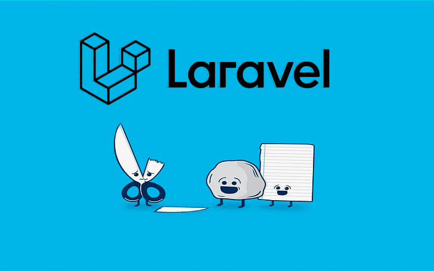

<p align="center"><a href="https://laravel.com" target="_blank"></a></p>

<p align="center">
<a href="https://github.com/laravel/framework/actions"></a>
<a href="https://packagist.org/packages/laravel/framework"></a>
<a href="https://packagist.org/packages/laravel/framework"></a>
<a href="https://packagist.org/packages/laravel/framework"></a>
</p>

## Seed

primero el de usuarios y luego el de rondas y por último el de las partidas

php artisan db:seed --class=UsuarioSeeder

php artisan db:seed --class=RondaSeeder

php artisan db:seed --class=PartidaSeeder


## EndPoints

### New user

`POST: /admin/user`

```json
{
  "nombre": "Miguel",
  "email": "miguel@example.com",
  "password": "StrongPassword!23"
}
```

crear nueva ronda:

{
  "id_user_1" : 1,
  "id_user_2" : 10,
}


## License

The Laravel framework is open-sourced software licensed under the [MIT license](https://opensource.org/licenses/MIT).
